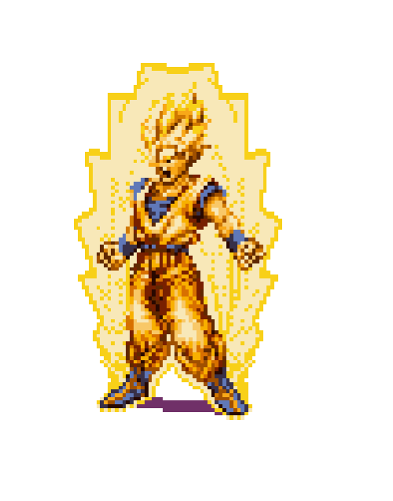

<!-- ========================= THEME =========================
Primary: #FFA500  |  Accent: #FF6F00  |  BG: #0D0D0D
=========================================================== -->

<!-- TOP WAVE BANNER -->

  

<!-- Title + subtitle -->
<h1 align="center">
  
</h1>

  

<!-- Badges -->

  
  
  
  
  

<!-- Quick links -->

  <a href="#-featured-projects">Projects</a> ·
  <a href="#-toolbox">Toolbox</a> ·
  <a href="#-education--certs">Education</a> ·
  <a href="#-connect">Connect</a>

---

## 🧠 Now
- 🧩 Building **accessible AI** (voice + LLM) so blind/low-vision learners can use interactive STEM simulations  
- ☁️ Shipping **cloud-native backends** (serverless + containers) with clean APIs + reliability-first design  
- 🏆 Hackathon winner: **Asclepius-HI (VillageHacks 2025 — Supermemory Track)**  

  

---

## ⚡ Highlights (fast facts)
<table>
  <tr>
    <td><b>Focus</b></td>
    <td>Accessible AI • Backend/Cloud • LLM Apps • Real-time Systems</td>
  </tr>
  <tr>
    <td><b>Current build</b></td>
    <td>Voice + natural-language control for interactive simulations (Chrome MV3 + AWS)</td>
  </tr>
  <tr>
    <td><b>Style</b></td>
    <td>Ship iteratively • measurable outcomes • strong DX • clean interfaces</td>
  </tr>
</table>

---

## 🧰 Toolbox

  <b>Languages</b> · <b>Backend & DevOps</b> · <b>Data & AI</b>

  

  

  

  

---

## 📌 Featured Projects

> Some work is under NDA/academic sponsorship; public repos reflect what I’m able to share.

| Project | What it is | Tech |
|--------|------------|------|
| **AI-Powered Accessible Simulation Chrome Extension** | Voice + natural-language control for interactive STEM simulations for **blind/low-vision learners** | Chrome MV3, TypeScript, AWS Lambda, FastAPI/Node, LLM APIs |
| [**Inspark A11y Assistant**](https://github.com/ethicalzeus07/inspark-a11y) | Automated WCAG checks (axe-core) with actionable remediation guidance | FastAPI, JS, axe-core |
| [**Data Dash (AWS)**](https://github.com/ethicalzeus07/datadash-eks) | Real-time metrics dashboard + streaming events + cloud deployment | FastAPI, WebSockets, Docker, AWS |
| [**Ballu / Ballsy Voice Assistant**](https://github.com/ethicalzeus07/ballsy-voice-assistant) | Local voice assistant pipeline + command execution foundation | Python, WebSockets, SQLite, Docker |
| **Asclepius-HI (Hackathon Winner)** | Memory-augmented healthcare copilot concept: triage + clinician summaries | React, FastAPI, RAG/Vector DB, Postgres |

---

## 💼 Experience
**ASU Center for Education Through Exploration (ETX)**  
*Platform QA & Support Engineer (Student)*  
- QA/testing + support workflows; emphasis on reliability, clarity, and accessibility

---

## 🎓 Education & Certs
**New York University (NYU) — Tandon School of Engineering** — Incoming **M.S. Computer Science (Fall 2026)**  
**Arizona State University (ASU)** — **B.S. Computer Science**, Minor in Business  
**AWS Certified** — Cloud Practitioner

---

## 🐍 Contribution Snake

  

---

## 🤝 Connect
- Email: **chauhanpravar7@gmail.com**
- LinkedIn: **pravar-chauhan-83845930a**
- Portfolio: **d3tx6hx7gzmh0g.cloudfront.net**

<!-- FOOTER WAVE -->

  

